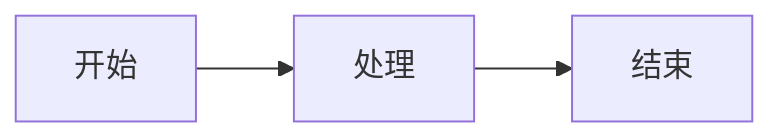

# 文章标题

> [!note] 文章摘要
> 在这里添加文章的简要描述或引言...

## 引言

文章内容从这里开始...

## 主要内容

### 小标题

更多内容...

> [!tip] 提示
> 这是一个提示框，可以用来突出重要信息。

> [!warning] 注意
> 这是一个警告框，用来提醒读者注意某些事项。

### 代码示例

```python
def hello_world():
    print("Hello, World!")
    return "Hello from HelianNuits!"
```

### 表格示例

| 功能 | 描述 | 状态 |
|------|------|------|
| 功能1 | 描述1 | ✅ |
| 功能2 | 描述2 | ⏳ |
| 功能3 | 描述3 | ❌ |

### 数学公式

$$
E = mc^2
$$

### 流程图



## 总结

在这里总结文章的主要内容...

---

> [!success] 相关链接
> - [相关文章1](link1)
> - [相关文章2](link2)
> - [外部资源](https://example.com) 