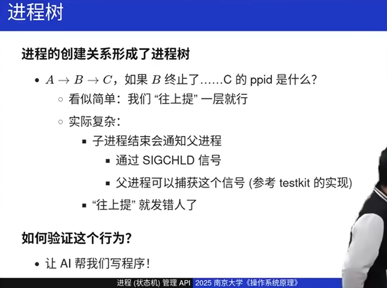

# NJU-JYYOS-05-进程API总结

## 进程

操作系统上运行的程序就是进程？过度简化❌

进程 = 进程状态 [进程、reg、mem] + 操作系统维护的额外（只读、系统调用获取）状态[进程号PID等]✅

**如何获取进程的基本信息：**除了使用 API (例如 getpid 是一个系统调用)，Linux `/proc` 文件系统允许我们使用文件 API (“everything is a file”) 访问当前进程的 ID、状态信息、命令行参数和工作目录等元数据。


> **Prompt: 我发现随着进程的创建，进程的 pid 是递增的；而 pid 是有限的 (32-bit 整数)，这是否意味着会循环导致 pid 重用？**
>
> 是的，您的观察是正确的。进程 ID (PID) 确实是有限的资源，通常是 32 位整数，理论上最大值为 2^32-1（约42亿）。随着进程不断创建，PID 会递增，当达到系统设定的最大值后，系统会循环并重新分配较小的、已经释放的 PID。
>
> 关于 PID 重用的几个重要点：
>
> 1. **PID 范围**：
>       - 在大多数 Linux 系统中，PID 的默认范围是从 1 到 32767（/proc/sys/kernel/pid_max）
>       - 在较新的 Linux 内核中，这个上限可以配置到 2^22（约400万）
>       - 在 64 位系统上，理论上限可以更高
> 2. **PID 分配机制**：
>       - 系统会维护一个 PID 位图或类似的数据结构来跟踪已使用和可用的 PID
>       - 新进程创建时，内核会分配下一个可用的 PID
>       - 当 PID 达到最大值后，系统会从较小的值开始重新搜索可用的 PID
> 3. **PID 重用策略**：
>       - 系统不会立即重用刚刚释放的 PID，通常会有一个"冷却期"
>       - 这是为了避免将新进程的 PID 分配给可能仍被其他进程引用的已终止进程
> 4. **PID 重用的潜在问题**：
>       - 安全隐患：如果一个进程正在引用另一个已终止的进程，而该 PID 被重用，可能导致权限问题
>       - 竞态条件：在多线程或多进程环境中，PID 重用可能导致意外行为
> 5. **PID 命名空间**：
>       - 现代 Linux 内核支持 PID 命名空间，允许在容器或虚拟化环境中隔离 PID 空间
>       - 这意味着不同命名空间中的进程可以使用相同的 PID 而不会冲突
>
> 总结来说，是的，PID 确实会循环重用，这是操作系统设计的必然结果，因为 PID 是有限资源。操作系统通过各种机制（如延迟重用、PID 命名空间等）来减轻 PID 重用可能带来的问题。


**测试重要！**


## 进程树

### 1. 进程返回值处理

- **父进程有`waitpid`**：父进程会继续等待子进程的返回，这种情况是因为还需要对返回值进行处理。
- **父进程没有`waitpid`**：不需要处理返回值，子进程返回值进行 “托孤” 处理，传递给操作系统的 “1 号进程”（实际情况可能是`user`下的`systemd`），进行忽略（UNIX 托孤机制）。

### 2. 进程树

- **进程创建关系**：进程的创建关系形成了进程树。例如，`A`创建`B`，`B`创建`C`。

  

  **子进程终止后的`ppid`问题**

  

  子进程如果返回时，原父进程消失怎么处理？

  不是直接传递给父进程的父进程

  

  - **看似简单**：如果`B`终止了，要找到`C`的父进程 ID（`ppid`），似乎只需要 “往上提” 一层就行。
  - **实际复杂：**
    - 子进程结束会通知父进程。
    - 通过`SIGCHLD`信号通知。
    - 父进程可以捕获这个信号（参考`testkit`的实现），但 “往上提” 就容易出错。





## `fork()`：无情的状态复制机

### 习题一 `fork()`函数的返回值


这段代码主要涉及到`fork()`函数的返回值


1. **代码内容**

    - ```
        pid_t x = fork();
        ```

     - 这里调用了`fork()`函数。`fork()`是一个系统调用，用于创建一个新的进程。新创建的进程是原进程的副本，称为子进程。
     - `pid_t`是一个数据类型，通常用于存储进程 ID。`x`将存储`fork()`调用返回的值。

    - ```
        pid_t y = fork();
        ```

     - 再次调用`fork()`函数，创建另一个新进程。`y`将存储这个`fork()`调用返回的值。

    - ```
        printf("%d %d\n", x, y);
        ```

     - 这行代码用于打印`x`和`y`的值。

2. **`fork()`函数的返回值**

    - 在父进程中，`fork()`返回新创建的子进程的 ID。
    - 在子进程中，`fork()`返回 0。
    - 如果`fork()`调用失败，它会返回 -1。

3. **运行结果分析**

    - 第一次调用`fork()`会创建一个子进程，此时有两个进程（父进程和子进程）。

    - 第二次调用`fork()`时，父进程和第一个子进程都会各自再创建一个子进程，此时总共有 4 个进程。

    - 对于每个进程，x和y的值会根据fork()的返回值而不同：

        - 父进程：`x`是第一个子进程的 ID，`y`是第二个子进程的 ID。
        - 第一个子进程：`x`是 0（因为它是子进程），`y`是第二个子进程的 ID（如果由它创建）或 0（如果第二个`fork()`由父进程创建）。
        - 第二个子进程（如果由第一个子进程创建）：`x`是 0，`y`是 0。
        - 第二个子进程（如果由父进程创建）：`x`是第一个子进程的 ID，`y`是 0。

4. **重要问题**

    - 这段代码一共创建了 4 个进程（包括父进程）。
    - `pid`（进程 ID）的值根据进程的不同而不同，如上述分析。
    - 从 “状态机视角” 来看，每个进程可以看作是一个状态机，`fork()`操作导致状态机的复制和分支。


### 习题二 `fork()`无情的状态机复制


涉及到`fork()`无情的状态机复制：

在这个例子中，我们发现执行 `./a.out` 打印的行数和 `./a.out | wc -l` 得到的行数不同。根据 “机器永远是对的” 的原则，我们可以通过提出假设 (libc 缓冲区影响) 求证、对比 strace 系统调用序列等方式，最终理解背后的原因。

> **终端输出**
>
> 
>
>  **1. 代码执行流程**
>
> - 每次循环：
>
>       1. 父进程调用 `fork()` 创建子进程。
>       2. **父进程和子进程都会执行** `printf("Hello\n");`。
>       3. 父子进程各自更新 `i` 并判断是否继续循环。
>
>  **2. 进程树分析**
>
> - **初始状态**：父进程 P，`i=0`。
>
> - 第一次循环（`i=0`）：
>
>       - P 调用 `fork()` 创建子进程 C1。
>       - **P 和 C1 都打印 "Hello"**。
>       - P 和 C1 的 `i` 自增为 1，继续循环。
>
> - 第二次循环（`i=1`）:
>
>       - P 调用 `fork()` 创建子进程 C2。
>       - C1 调用 `fork()` 创建子进程 C3。
>       - **P、C1、C2、C3 都打印 "Hello"**。
>       - 所有进程的 `i` 自增为 2，循环结束。
>
>  **3. 打印次数计算**
>
>   - **第一次循环**：2 个进程（P、C1）各打印 1 次，共 **2 次**。
>   - **第二次循环**：4 个进程（P、C1、C2、C3）各打印 1 次，共 **4 次**。
>   - **总计**：2 + 4 = **6 次**。
>
> 

> **管道输出**
>
> 运行 ./demo-2 | wc -l 时，显示为8次
>
> 机器是完全对的！
>
> 这涉及管道
>
> **关键知识点：标准输出缓冲**
>
> 在 C 语言中，`printf` 的输出行为取决于：
>
> 
>
> - **终端输出（交互式）**：默认使用**行缓冲**（遇到换行符 `\n` 立即刷新缓冲区）。
> - **管道输出（非交互式）**：默认使用**全缓冲**（缓冲区满或手动刷新 `fflush` 时才输出）。
>
> 
>
> **初始状态**：父进程 P，`i=0`。
>
> - 第一次循环（`i=0`）:
>
>       - P 调用 `fork()` 创建子进程 C1。
>       - **P 和 C1 的缓冲区均写入 `"Hello\n"`，但未刷新**。
>
> - 第二次循环（`i=1`）:
>
>       - P 调用 `fork()` 创建子进程 C2，此时 P 的缓冲区包含 `"Hello\n"`。
>       - C1 调用 `fork()` 创建子进程 C3，此时 C1 的缓冲区包含 `"Hello\n"`。
>       - **所有进程（P、C1、C2、C3）的缓冲区再次写入 `"Hello\n"`**。
>
> - 进程终止:
>
>       - 每个进程的缓冲区包含 **2 个 `"Hello\n"`**（第一次和第二次循环各一个）。
>       - **每个进程终止时刷新 2 行**，共 4 个进程，总计 **8 行**。


## **`execve()`：复位状态机**
```c
int execve(const char *filename,
            char * const argv[], 
            char * const envp[]);

```

- **作用**：将**当前进程**的内存空间、代码、数据等全部替换为新程序（`filename`），但保留进程 ID、打开的文件描述符等操作系统维护的状态。
- **类比状态机**：进程原本执行 A 程序，调用`execve()`后 “重置” 为执行 B 程序的初始状态，但进程 ID 等元数据不变。

- **唯一执行程序的系统调用**：所有程序执行（如`bash`执行`ls`）最终都通过`execve()`实现。
- **进程连续性**：进程 ID 不变，但代码和数据完全替换，类似于 “灵魂出窍”。
- **错误处理**：若失败（如文件不存在），返回 - 1，原程序继续执行。


###  **`execve()` 的工作原理**

当进程调用 `execve("/path/to/program", argv, envp)` 时：


1. **加载新程序**：操作系统将指定的可执行文件（`/path/to/program`）加载到当前进程的内存空间，覆盖原有代码和数据。

2. **重置执行环境**
    - 程序计数器（PC）设置为新程序的入口点（通常是 `main()` 函数的地址）。
    - 堆栈（Stack）被清空并重新初始化，用于存储新程序的局部变量和函数调用信息。
    - 数据段（Data）和堆（Heap）被替换为新程序的数据。
   
3. **保留操作系统状态**
    - 进程 ID（PID）不变，仍为原进程的 ID。
        - 打开的文件描述符（如标准输入 / 输出）继续有效（除非设置了 `O_CLOEXEC` 标志）。
    - 当前工作目录、用户权限等保持不变。

### 为什么原程序的后续代码不执行？

- **内存覆盖**：`execve()` 成功后，原程序的代码和数据被新程序完全替换，后续代码（即 `execve()` 调用之后的语句）已不存在于内存中。
- **PC 重置**：程序计数器指向新程序的入口，原程序的执行流程被彻底终止。
- **类比**：就像用新的电影胶片替换放映机中的旧胶片，屏幕上只会播放新胶片的内容，旧胶片的剩余部分不会被显示。


## **`_exit()`：销毁状态机**

```c
void _exit(int status);
```

- **作用**：立即终止当前进程，释放资源（内存、文件描述符等），并将`status`返回给父进程（通过`wait()`获取）。

- 特点:

    - **直接终止**：不执行任何清理工作（如刷新标准输出缓冲区、调用`atexit()`注册的函数）。
    - **不可恢复**：进程彻底销毁，状态码由操作系统传递给父进程。

- **对比**：`exit()`是 C 库函数，会先执行清理工作（如刷新缓冲区），再调用`_exit()`。


## **进程状态机视角**

- **创建**（`fork()`）：复制父进程状态，生成新进程。

- **复位**（`execve()`）：保留进程 ID 等元数据，替换代码和数据。

- **销毁**（`_exit()`）：终止进程，释放资源。

- 关键点:

    - 进程 ID、打开的文件描述符等由操作系统维护，不受`execve()`影响。
    - 程序员需注意：若父进程打开文件后`execve()`，子进程可能继承该文件描述符（除非设置`O_CLOEXEC`标志）。


## **总结**

这部分内容揭示了 UNIX 进程管理的核心逻辑：


1. **进程 = 状态机**：通过`fork/execve/_exit`实现状态的创建、转换和销毁。
2. **`execve()`的核心地位**：所有程序执行的底层机制，负责加载新程序到现有进程。
3. **环境变量的传递**：通过`envp`数组实现，影响程序行为和搜索路径。
4. **资源管理**：`_exit()`确保进程终止时资源被正确释放。
